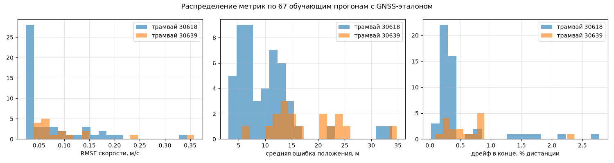
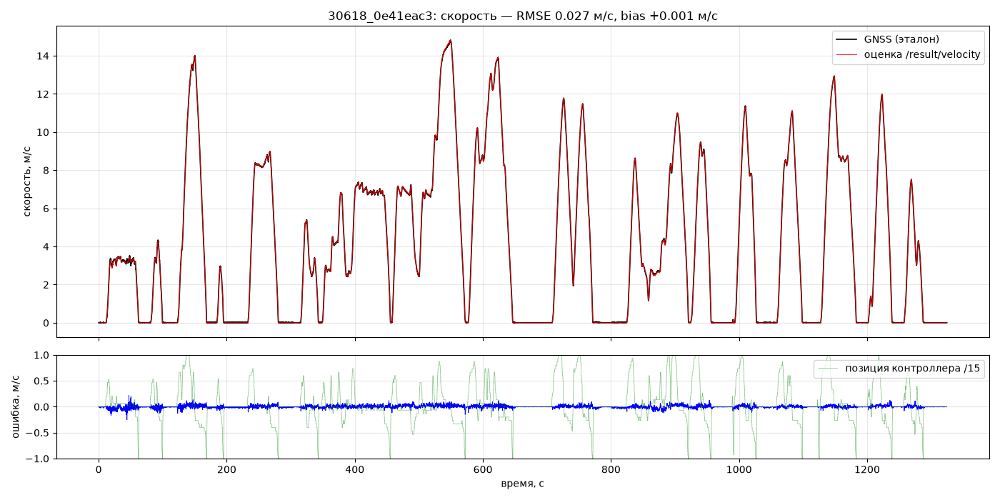
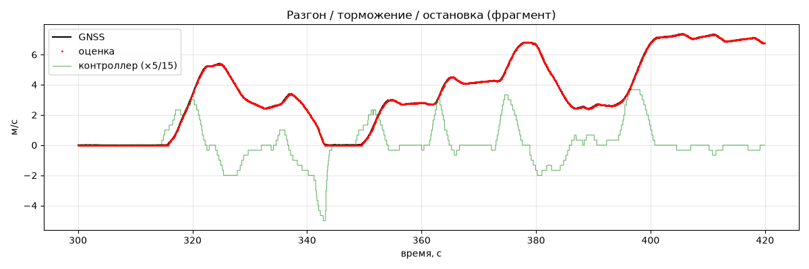
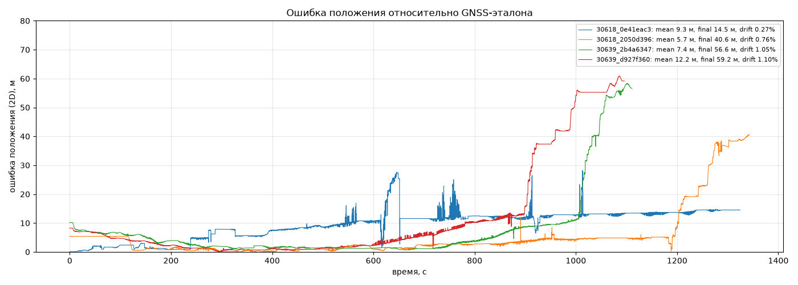
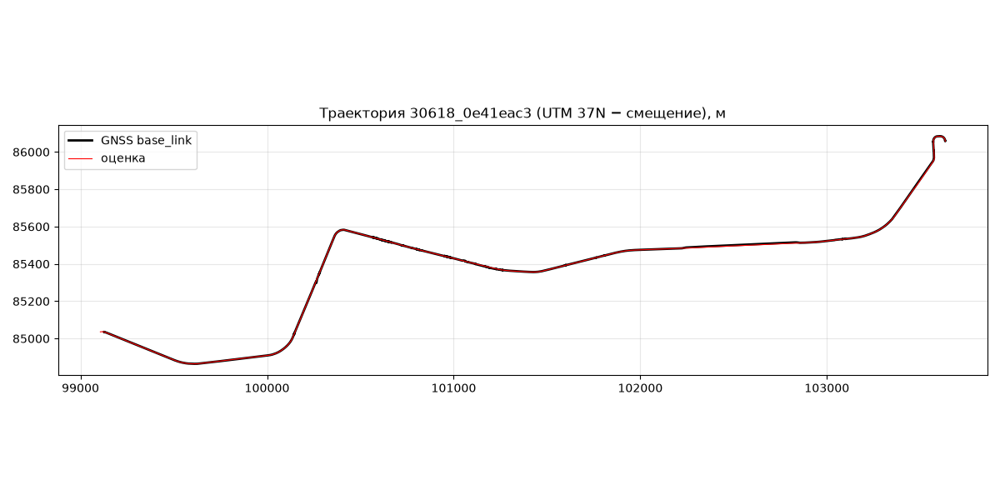
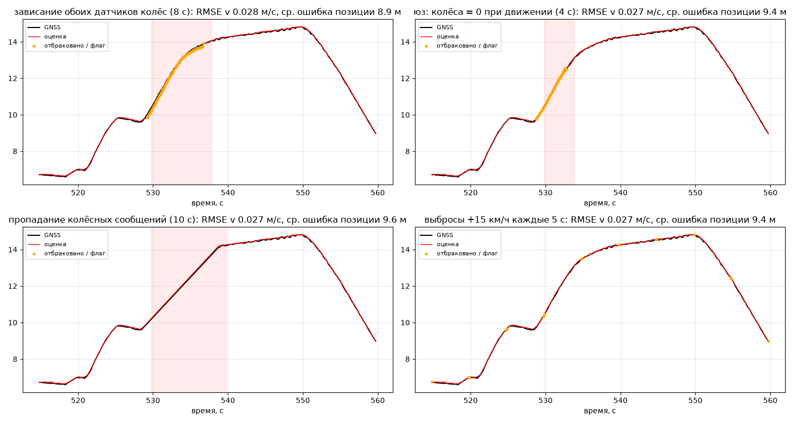

# Точность и быстродействие

## 1. Методика сравнения с эталоном

**Эталон.** GNSS-телеметрия из тех же bag-файлов, которая в основном контуре решения **не используется**
(принимается только в первые 5 с для стартовой точки). Скорость - `hypot(twist.linear.x, y)` из `/sensing/gnss/master/vel`
(м/с). Положение - base_link, вычисленное из двух антенн (`master` на $x=-9.873$ м, `rover` на $x=+2.563$ м в base_link,
по данным организаторов): $\mathbf{p}_{bl} = \mathbf{p}_{rover} + 0.206\,(\mathbf{p}_{master}-\mathbf{p}_{rover})$,
пересчёт WGS-84 -> UTM 37N минус (300 000, 6 100 000) - система координат pathgraph и эталона.

**Сопоставление.** Как у судьи: каждому нашему сообщению ставится в соответствие эталон с ближайшей `header.stamp`
в пределах 0.05 с (по факту сопоставляется 100 % сообщений). Метрики:
- скорость: RMSE, MAE, bias (среднее подписанное) по всему прогону;
- положение: 2D-ошибка $\sqrt{\Delta x^2+\Delta y^2}$ - среднее, медиана, RMSE, максимум; ошибка в конце прогона;
  дрейф = ошибка в конце / пройденная дистанция.

**Выборка.** Все 122 bag проверены на дубликаты (25 пар - побайтовые копии) и наличие GNSS (35 bag трамвая 30618
без GNSS вовсе). Для оценки взяты **67 уникальных прогонов длиннее 10 мин с полным GNSS**: 50 - трамвай 30618,
17 - 30639; суммарно ~36 ч, ~360 км. Калибровка (масштабы колёс, таблица тяги) выполнена на этих же прогонах -
оценка на них не является строго out-of-sample; однако параметров мало (2 масштаба + таблица медиан), поэтому
переобучение не выражено (см. ниже сравнение с ROS-прогоном и трамваем 30639 с в 3 раза меньшей выборкой).

Два независимых пути расчёта:
1. **Офлайн** (`tools/evaluate.py`): то же ядро `Estimator`, сообщения подаются в порядке меток времени - 67 прогонов
   за ~1 мин, для калибровки и регрессионных проверок.
2. **ROS 2 в реальном времени** (`tools/judge_run.sh` в Docker): нода + `ros2 bag play --rate 1.0` + `ros2 bag record`
   выходов + метрики по записи (`tools/eval_recorded.py`) + замер CPU/ОЗУ. Именно так проверяет жюри.

## 2. Точность на 67 прогонах (офлайн, финальная версия)

Все 67 прогонов (50 - трамвай 30618, 17 - 30639):

| Метрика | Медиана | Среднее | 90-й перцентиль | Худший |
|---|---|---|---|---|
| RMSE скорости, м/с | **0.05** | 0.08 | 0.17 | 0.36 |
| MAE скорости, м/с | 0.02 | 0.03 | 0.05 | 0.12 |
| \|bias\| скорости, м/с | 0.004 | 0.013 | 0.030 | 0.084 |
| Средняя ошибка положения 2D, м | **11.1** | 11.9 | 22.2 | 34.8 |
| RMSE положения, м | 12.9 | 15.4 | 30.2 | 40.2 |
| Максимальная ошибка положения, м | 39 | 48 | 87 | 164 |
| Ошибка в конце прогона, м | **16.8** | 27.7 | 53.7 | 156 |
| Дрейф, % дистанции (≈5.4 км) | **0.31** | 0.51 | 1.02 | 2.78 |
| Отбраковано измерений колёс, % | 0.00 | 0.04 | 0.22 | 0.35 |

Только трамвай **30618** (на нём проводится проверка; 50 прогонов):

| Метрика | Медиана | Среднее | 90-й перцентиль | Худший |
|---|---|---|---|---|
| RMSE скорости, м/с | **0.03** | 0.07 | 0.16 | 0.34 |
| Средняя ошибка положения 2D, м | **8.7** | 10.0 | 14.7 | 33.9 |
| Ошибка в конце прогона, м | **15.7** | 25.8 | 69.0 | 156 |
| Дрейф, % дистанции | **0.30** | 0.48 | 1.33 | 2.78 |

Трамвай 30639 (17 прогонов, медианы): RMSE v 0.070 м/с, положение 14.5 м, финал 28 м, дрейф 0.53 % - шумнее задняя
тележка и в 3 раза меньше данных для калибровки.



**Откуда ошибка положения.** Два фактора: (1) старт с платформы, которой нет в карте (31 из 67 прогонов; у Таллинской
несколько путей) - компенсируется поправкой стартовой дистанции, остаточная ошибка таких прогонов ~12 м против ~8 м;
(2) масштаб колёс, меняющийся между датами записей до 1 % (см. ограничения). Худшие прогоны (>30 м) - заезды на ветки
вне маршрута (депо).

**Без GNSS вообще.** Если стартовая конечная задана параметром (`default_start`) верно, точность та же:
медианная ошибка положения 13.8 м против 13.3 м с GNSS-выставкой, финал 23 м (65 прогонов). Стартовая конечная в
данных распределена 33/32 между Щукинской и Таллинской.

## 2а. Проверка скриптом организаторов на их тестовом bag (вне обучающей выборки)

Организаторы выложили проверочный пакет `check-code` с их нодой-судьёй `hackathon_solution_checker` и bag
`30618_88aea4d9` (22 мин, 5.3 км), которого нет в обучающем наборе. Эталон судьи - `/localization/kinematic_state`
(50 Гц, кадр `map`, совпадает с системой координат pathgraph: медианное расхождение 0.34 м, по высоте 0.00 м).
Мы прогнали нашу ноду через этот судью без изменений (`tools/organizers_check.sh`; лог судьи: `docs/logs/organizers_checker_30618_88aea4d9.log`):

| Метрика судьи | Значение |
|---|---|
| Скорость, RMSE / max | **0.052 м/с** / 0.36 м/с |
| Положение x, RMSE / max | 6.9 м / 33 м |
| Положение y, RMSE / max | 4.7 м / 30 м |
| Положение z, RMSE / max | 0.13 м / 0.49 м |
| 3D-расстояние, RMSE / max | **8.4 м** / 42 м |
| Сопоставлено пар | 50 542 |

Тот же bag, прогнанный участником команды на Windows 11 / x86_64 из опубликованного образа нашим скриптом проверки
с эталоном `/localization/kinematic_state` (`docs/logs/windows_x86_organizers_bag_30618_88aea4d9.log`): скорость RMSE
0.048 м/с, положение 3D RMSE 8.9 м, z 0.1 м, 38.5 Гц, задержка 0.31 мс, 100 % сообщений сопоставлено.

Этот же bag показал, что масштаб колёс, откалиброванный по GNSS-скорости, завышен на 0.18 %: модуль зашумлённого
вектора скорости GNSS смещён вверх, особенно на малых скоростях. Масштабы пересчитаны к эталону судьи
(`wheel_scale_*` в `calib_*.yaml`, прежние значения сохранены как `*_gnss`); на обучающих прогонах средняя ошибка
положения трамвая 30618 при этом улучшилась с 10.0 до 8.7 м.

## 3. Графики

Скорость на полном прогоне 30618_0e41eac3 (22 мин, 5.3 км): RMSE 0.027 м/с, bias +0.001.


Переходные режимы - разгон, торможение, остановка - без запаздывания и смещения:


Ошибка положения по времени на четырёх прогонах (оба трамвая, оба направления):


Траектория (оценка поверх эталона), включая разворотные петли на конечных:


## 4. Устойчивость к аномалиям (критерий 3)

В реальных данных явные слипы/зависания редки (0.3 % отсчётов у 30618, 1-2 % у 30639), поэтому дополнительно
аномалии внесены **синтетически** в реальный прогон (`tools/evaluate.py --anomaly ...`) на 40 % длины:

| Аномалия | RMSE v, м/с (база 0.027) | Ср. ошибка положения, м (база 9.2) | Комментарий |
|---|---|---|---|
| зависание переднего датчика 8 с | 0.027 | 9.2 | обнаружено по повтору значения, отбраковано, ведёт задняя тележка |
| зависание **обоих** датчиков 8 с | 0.028 | 8.9 | обнаружено (модель предсказывает изменение скорости), ведёт модель |
| юз: колёса = 0 при движении 4 с | 0.027 | 9.2 | отбраковано воротами, ведёт модель торможения |
| слип передней тележки ×1.4 (5 с) | 0.027 | 9.2 | отбраковано воротами |
| выбросы +15 км/ч каждые 5 с | 0.027 | 9.2 | отбраковано (2 % измерений) |
| пропадание колёсных сообщений 3 с | 0.027 | 9.2 | модель по контроллеру |
| пропадание колёсных сообщений 10 с | 0.027 | 9.6 | модель по контроллеру |
| гауссов шум σ = 2 км/ч на всех отсчётах | 0.14 | 21 | ворота отбраковывают 3-6 %; с `adapt_r: true` - лучше |



Расходимости (drift blow-up) нет ни в одном случае; после аномалии одометрия перезахватывается автоматически.
Нода не падает на пустых/NaN/некорректных сообщениях (проверка `isfinite`, нулевые координаты GNSS игнорируются).

## 5. Реальное время и ресурсы (критерий 4)

Полный прогон 30618_0e41eac3 (22 мин) в Docker с ограничением **`--cpus=2 --memory=512m`**, `ros2 bag play --rate 1.0`
(лог: `docs/logs/realtime_run_mac_arm64_30618_0e41eac3.log`):

| Показатель | Требование | Измерено |
|---|---|---|
| Частота `/result/velocity`, `/result/position` | >= 10 Гц (реком. 20-50) | **38.7 Гц** (51 303 сообщения за 1327 с) |
| Задержка вход -> публикация (внутри ноды, callback->publish) | <= 100 мс (пик <= 250) | **0.4-0.6 мс средняя, пик 1.6 мс** (на ускоренном воспроизведении ×5 - пик 4-5 мс) |
| CPU ноды | <= 2 ядра | **≈ 10 % одного ядра** (среднее по 266 замерам) |
| ОЗУ ноды (RSS) | <= 0.5 ГБ | **59 МБ**, без роста за 22 мин |
| Точность в ROS-прогоне | - | RMSE v 0.042 м/с, bias +0.001; положение среднее 9.9 м, макс 28 м; финал 14.3 м, дрейф 0.27 % |
| Сопоставлено с эталоном | - | 100 % сообщений (метки времени из bag) |

Независимый повтор на **Windows 11 / Docker Desktop / x86_64** из опубликованного образа (`docs/logs/realtime_run_windows_x86_30618_0e41eac3.log`):
38.7 Гц, задержка 0.42 мс (пик 1.5 мс), 6.4 % ядра, 59 МБ; RMSE v 0.029 м/с; положение среднее 12.6 м, финал 18.6 м, дрейф 0.35 %.
Поведение на arm64 и x86_64 совпадает.

Метки времени выходов = `header.stamp` входных сообщений; из-за чередования колёс (метка отстаёт на ~35 мс) и
контроллера метки не строго монотонны в пределах 35 мс - на сопоставление с эталоном (допуск 50 мс) не влияет.
Сборка - стандартный `colcon build`, зависимости только из состава ROS 2 (rclpy, PyYAML); интернет при сборке
пакетов не требуется. Утечек памяти не наблюдается (RSS постоянен 58.7 МБ на протяжении прогона); нода однопоточная
(single-threaded executor), гонок нет.

## 6. Воспроизведение цифр

```bash
# офлайн, все 67 прогонов (нужны: python3.11 venv с rosbags, numpy, scipy, pandas, pyproj; кэш бэгов tools/build_cache.py)
python tools/evaluate.py --all --save eval.csv
python tools/evaluate.py --bags 30618_0e41eac3 --anomaly freeze_both
# в ROS 2 / Docker (как жюри)
docker run --rm --cpus=2 --memory=512m -v $DATA:/data:ro -v $(pwd)/results:/out lcm-odometry bash /tools/judge_run.sh /data/30618_0e41eac3 30618
```
